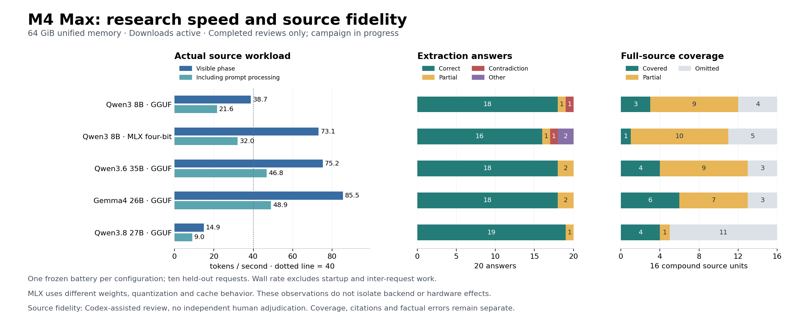

# Apple M4 Max local AI campaign

**Status: campaign in progress, September 10, 2026 (Asia/Singapore).** Qwen8 CPU/Metal, MLX execution, and Qwen35/Gemma26/Qwen27 speed and source reviews are complete. Remaining models and the 235B capacity candidate are still downloading or awaiting tests. This is a different computer from the existing M5 Pro report; historical results remain unchanged.

## Research usefulness so far

| Configuration | Visible tokens/s | Tokens/request wall second | Extraction correct / partial / other (20) | Full-source coverage complete / partial / omitted (16) |
|---|---:|---:|---|---|
| [Qwen8 Q4_K_M, Metal](results/2026-09-10/m4-max/history/qwen3-8b/README.md) |38.75|21.61|18 / 1 / 1 contradiction|3 / 9 / 4|
| [Qwen8 group64 four-bit, MLX](results/2026-09-10/m4-max/mlx-history/README.md) |73.11|32.04|16 / 1 / 1 contradiction + 2 false abstentions|1 / 10 / 5|
| [Qwen35 UD-Q4_K_M, Metal](results/2026-09-10/m4-max/history/qwen36-35b/README.md) |75.24|46.81|18 / 2 / 0|4 / 9 / 3|
| [Gemma26 Q4_K_M, Metal](results/2026-09-10/m4-max/history/gemma4-26b/README.md) |85.46|48.92|18 / 2 / 0|6 / 7 / 3|
| [Qwen27 UD-Q4_K_M, Metal](results/2026-09-10/m4-max/history/qwen38-27b/README.md) |14.89|9.02|19 / 1 / 0|4 / 1 / 11|

Gemma and Qwen35 exceed 40 on both observed rates. They still produce source errors and omit material; neither is an unchecked research recommendation. Qwen35’s merged output copies all four direct summaries, including their errors. Qwen27 has one more correct extraction answer, but its full-source control omits 11 compound units and its measured research rate is far below 40. MLX Qwen8 is faster than the GGUF configuration but drops an entire excerpt from synthesis. All five correctly abstain on the four genuinely source-absent questions; MLX also falsely abstains on two stated answers.

These are one-battery observations on a small selected OCR workload. Request wall rates include prompt processing but exclude startup and inter-request work. Model outputs and quantization differ; this is not an isolated backend or hardware comparison. Codex-assisted ledgers preserve all 20 extraction judgments, 48 applicable coverage judgments and grouped claims for each completed configuration, with no independent human adjudication.

[Same-artifact system comparison](results/2026-09-10/m4-max/matched-system-comparison.md), [synthetic speed and five-sample variation](results/2026-09-10/m4-max/speed.md), [CPU baseline](results/2026-09-10/m4-max/cpu.md), and [MLX short inference/matrix observations](results/2026-09-10/m4-max/mlx.md) remain separate from source fidelity.



## Verified machine and runtime

- Apple M4 Max MacBook Pro: 16 CPU cores (12 performance, four efficiency), 40 GPU cores, 64 GiB unified memory (68,719,476,736 bytes).
- macOS 26.6, build 25G72; AC connected, Automatic power mode. Initial system swap was zero. No initial thermal/performance warning was reported by `pmset`.
- Official llama.cpp b10852 macOS arm64 release, commit `050dde50c`; archive SHA-256 `0a1bd66656354e43bc90fb7d7ce5a56c5683f338706e5d59fd4e38e7f44c4008`. Metal device `MTL0` initialized successfully. Driver recommended working set: 55,662,788,608 bytes (~51.84 GiB), not a guaranteed model capacity.
- MLX 0.32.2 and mlx-lm 0.31.3 installed in a local virtual environment. MLX reports the M4 Max GPU available. Actual MLX inference completed; three warmed short-prompt runs averaged 89.52 tokens/s. This uses different weights/quantization and timing from the GGUF protocol.
- Apple Command Line Tools installed successfully: package `26.6.0.0.1781586589`; Apple clang 21.0.0 executes. These tools support source builds; the official prebuilt llama.cpp already ran without them.

[Configuration](results/2026-09-10/m4-max/configuration.json), [MLX setup](results/2026-09-10/m4-max/mlx-configuration.json), and [capacity provenance](results/2026-09-10/m4-max/candidate-research.json) preserve the details without hardware serial numbers or UUIDs.

## Planned measurements and interpretation

The exact five original comparison artifacts are Qwen3 8B, Qwen3.6 35B-A3B, Gemma4 26B-A4B, Qwen3.8 27B and Nemotron49B, pinned in `scripts/models.json`. The prior Qwen3.5 122B UD-IQ2_XXS artifact is also included. Synthetic protocol remains five measured repetitions after default warmup; pp512 and tg256 at depth zero, then tg256 at depth 2,048; FP16 K/V, flash attention, batch/microbatch 512, ten threads, single Metal device and all layers requested. Actual placement and failures must be checked.

**The user explicitly requests downloads continue during inference.** The new `scripts/run-m4-benchmark.py` preserves the original protocol but omits its download-suspension wrapper. Results therefore describe a desktop with concurrent transfers, not a controlled download-isolated experiment. Transfers can use CPU, memory buffers and SSD bandwidth even with unified memory. Their effect is unmeasured, not assumed large or zero. Retain five samples and variation; qualify load/wall timing especially. No timed inference overlapped Apple installation. Workspace analysis, plotting setup and file verification also overlapped portions of the campaign. [Aggregate background samples](results/2026-09-10/m4-max/background-downloads.json) document continuing model-file growth without publishing process paths or network addresses.

A separate CPU baseline and MLX application/kernel observations completed. MLX uses `mlx-community/Qwen3-8B-4bit` revision `545dc4251c05440727734bcd94334791f6ab0192`, which differs in weight format and quantization from the GGUF baseline. These rows must not be presented as an isolated backend comparison.

The frozen history-v2 fixtures passed all 17 integrity checks. Application tests use the existing Mac adaptation, 32K context and a declared 1,024 MiB RAM prompt-cache limit. Preserve the predeclared rubric in `experiments/history-v2-mac/README.md`; separate correctness, partial answers, citation fidelity, coverage, and instruction compliance. Judgments are Codex-assisted, not independently human-adjudicated.

## Capacity candidate

Qwen3-235B-A22B-Thinking-2507 IQ1_S is selected for a bounded capacity experiment: 235B total / 22B active parameters, 47,948,249,568 bytes (~44.65 GiB) of weights. Exact publisher revision and SHA-256 are in `scripts/mac-extra-models.json`. Initial readable-output check uses 4,096 context tokens and native thinking mode, distinct from reasoning-off comparisons.

IQ1_S is aggressive quantization and can damage quality. A file below physical memory does not prove usability. Retain actual layer placement, memory pressure, system swap growth, process RSS, failures, readable output, and context. A one-GiB swap-growth guard stops excessive paging; it does not prove zero paging. No GPU memory limits are raised. Larger inspected recipes are documented as preflight exclusions. This is a selected candidate search, not a universal largest-model claim.

## Reproduction

```sh
sh scripts/setup-mac.sh
python3 scripts/get-model.py qwen3-8b
caffeinate -i python3 scripts/run-m4-benchmark.py qwen3-8b --output local-results/m4-max-speed --timeout-seconds 1200
python3 scripts/history_v2/runner.py validate
caffeinate -i python3 scripts/history_v2/run_mac.py qwen3-8b --output local-results/m4-max-history/qwen3-8b --cache-ram-mib 1024
# After downloading the separately pinned capacity artifact:
python3 scripts/get-model.py qwen235-thinking-iq1s
caffeinate -i python3 scripts/check-m4-capacity.py qwen235-thinking-iq1s --context 4096
```

Run only one inference workload at a time on AC. Model downloads may continue by the stated user policy. Each model download verifies SHA-256 before promotion. Source builds, downloads, unreviewed raw logs and model weights remain local. Measured results and sanitized reproducible evidence will be added incrementally to `results/2026-09-10/m4-max/`.
