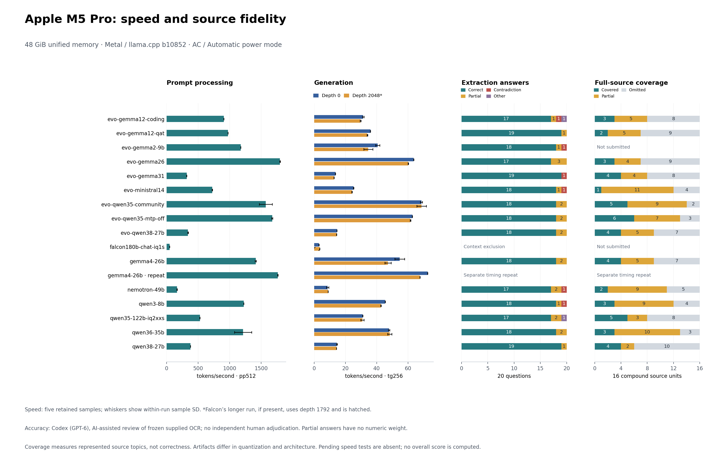

# Apple M5 Pro inference measurements

This campaign completed speed tests for **16 exact artifacts** and source-fidelity reviews for **15 history cases**. It retains **51 five-sample speed measurements** across 17 sessions, including one separate Gemma repeat, and **179 submitted history requests**, including 30 development requests excluded from held-out scores. Fourteen models received the full battery; Gemma2 received all 11 requests that fit its supported context. Falcon180 is excluded from the long-source battery. The [matched-artifact speed table](results/2026-09-08/mac/matched-speed-comparison.md) and [accuracy scoreboard](results/2026-09-08/mac/accuracy/scoreboard.md) preserve every result and exclusion.

The campaign began on September 8 and continued into September 9, 2026, in Asia/Singapore. The results directory retains the start date; individual receipts preserve actual timestamps. The [combined results index](results/2026-09-08/mac/README.md) places the separate speed and fidelity measurements together.

The fastest measured history configuration was **community Qwen3.6 35B-A3B Q4_K_M**, at **70.26 visible tokens/s** and **46.81 tokens per generation-request wall second** including prompt processing. It answered 18 of 20 extraction questions correctly, with two partial answers, but its longer outputs still contained unsupported claims and lost qualifications. Its full-source control covered five compound units fully, nine partially and omitted two. This is the strongest measured speed result for the target, not an overall accuracy winner.

Five artifacts exceeded 40 visible tokens/s on their actual held-out outputs:

| Exact artifact ID | Visible phase tokens/s | Tokens / request wall second | Correct / partial / other extraction answers, out of 20 |
| --- | ---: | ---: | --- |
| evo-qwen35-community | 70.26 | 46.81 | 18 / 2 / 0 |
| evo-qwen35-mtp-off | 58.36 | 41.69 | 18 / 2 / 0 |
| evo-gemma26 | 57.52 | 39.57 | 17 / 3 / 0 |
| gemma4-26b | 49.94 | 33.47 | 18 / 2 / 0 |
| qwen36-35b | 46.94 | 33.75 | 18 / 2 / 0 |

Only the first two also exceeded 40 when measured generation-request wall time is included. These rates exclude server startup, preflight tokenization and pauses between requests. They are single-battery observations with common-prefix caching and possible download overlap, separate from synthetic throughput and its five-sample uncertainty. Qwen3 8B illustrates the distinction: synthetic generation exceeded 40, while actual visible history output averaged 38.79 tokens/s.

No model preserved all 16 compound source units fully in its independent full-source summary. Several omitted entire passages despite receiving complete inputs and stopping below the output cap. Direct passage summaries generally retained more source topics, while synthesis often copied their errors and exceeded the requested word count. The [source-linked ledgers](results/2026-09-08/mac/accuracy/README.md) separate these findings from extraction, citations and format compliance. The evaluator was Codex (GPT-6), with AI-assisted review and no independent human adjudication; the task measures fidelity to the supplied Oman OCR rather than general historical accuracy.



[Vector chart](results/2026-09-08/mac/speed-and-accuracy.svg). Speed, answer correctness and coverage are separate measures; context exclusions and the separate timing repeat are labeled. The chart is generated from the linked tables by `scripts/plot-mac.py` with Matplotlib. It does not compute an overall ranking.

## Computer

| Component | Measured configuration |
| --- | --- |
| Computer | MacBook Pro, Mac17,9 |
| Processor | Apple M5 Pro, 18 CPU cores (6 Super + 12 Performance) |
| GPU | Apple M5 Pro, 20 GPU cores, Metal 4 |
| Unified memory | 51,539,607,552 bytes = 48 GiB (marketed as 48 GB) |
| Operating system | macOS 26.5.1, build 25F80 |
| Power | AC connected; Automatic mode (High and Low Power disabled) |
| Available storage before model downloads | Approximately 1.8 TiB |
| Built-in display | 3024 × 1964 |

The selected configuration fields are retained in [configuration.json](results/2026-09-08/mac/configuration.json). Serial numbers, usernames and raw private diagnostics are not published.

## Matched method

The Mac uses the **official llama.cpp b10852 macos-arm64 release**, build commit `050dde50c`, with **Metal device MTL0**. Its archive SHA-256 is `0a1bd66656354e43bc90fb7d7ce5a56c5683f338706e5d59fd4e38e7f44c4008`. This is the same runtime revision as the Windows tests, with different OS, processor architecture and backend binaries.

Model artifacts and hashes are pinned in [scripts/models.json](scripts/models.json) and [scripts/mac-extra-models.json](scripts/mac-extra-models.json). Settings match the Windows protocol: single device, all layers requested (`-ngl 99`), split mode none, flash attention on, FP16 K/V cache, batch/microbatch 512, ten CPU threads, five measured repetitions after default warmup. Prompt processing uses 512 tokens at depth 0; generation uses 256 tokens at initial depths 0 and 2,048. Default `auto` loading and lazy-loading modes are preserved. Benchmark contexts are computed from the workload, not set to the model's advertised maximum context.

The [artifact inventory](results/2026-09-08/mac/model-inventory.md) distinguishes branded sizes, observed tensor counts, full file bytes and active MoE parameters. Google reports 3.8B active parameters for Gemma26, while Qwen reports 3B for Qwen35 and 10B for Qwen122. Dense and MoE parameter counts therefore do not imply equal work per generated token.

Each timed test runs alone. This task's model downloader is suspended during the matched benchmark processes and resumed afterward. The machine remains in ordinary desktop use; background OS/app load, thermals and power draw were not controlled or measured as a laboratory experiment. `caffeinate -i` temporarily prevents idle system sleep while the job is alive; it does not prevent lid-close sleep or shutdown.

## Completed Qwen3 8B comparison

| Backend and computer | Prompt 512, depth 0 (tokens/s) | Generation 256, depth 0 (tokens/s) | Generation 256, depth 2,048 (tokens/s) |
| --- | ---: | ---: | ---: |
| M5 Pro Metal | 1223.444555 ± 1.048758 | 45.428603 ± 0.048200 | 42.709360 ± 0.171612 |
| Arc Pro B70 SYCL, initial | 1172.082569 ± 47.775965 | 77.695988 ± 10.265358 | 72.838920 ± 0.272410 |
| Arc Pro B70 SYCL, depth-0 repeat | 1252.820604 ± 3.004581 | 83.505046 ± 0.270528 | — |
| Evo X3 / Radeon 8060S Vulkan | 1237.73 ± 5.22 | 43.62 ± 0.05 | 40.90 ± 0.08 |
| RTX 5060 Laptop CUDA | 2499.242882 ± 198.107840 | 67.091562 ± 0.795381 | 62.005866 ± 1.415181 |

Values are means ± sample standard deviations. All five samples are preserved; no outlier is removed. Existing laptop Vulkan measurements remain in [README.md](README.md). The Evo row comes from the separately published [matched Qwen8 synthetic report](results/2026-09-08/evo/qwen8-synthetic-speed.md); it is not a new measurement on this Mac. Evo’s other Qwen artifacts have different hashes from the original Arc files and receive distinct IDs and Mac runs in the [extended comparison](results/2026-09-08/mac/matched-speed-comparison.md). Only rows with identical artifact IDs are weight-matched comparisons. In the Qwen8 tests, Mac generation is slower than the Arc SYCL and RTX CUDA configurations. These are complete-system/backend measurements, not isolated GPU rankings or proof of peak throughput.

A separate [local chat smoke check](results/2026-09-08/mac/output-qwen3-8b) at a 4,096-token context answered 42 and Paris and gave a coherent explanation of model-size costs. This single prompt is not an accuracy score. It used the local server chat template with thinking disabled; model downloads continued during this untimed response check.

Both Mac runs confirmed **37/37 layers offloaded**. The model uses a **4,789.19 MiB MTL0_Mapped buffer**. FP16 KV allocations are 72 MiB for pp512, 36 MiB for short generation and 324 MiB for generation at depth 2,048. System swap used remained zero throughout sampled loading and inference. All-layer offload still permits CPU work and host allocations.

## Source-fidelity accuracy

The requested accuracy tests use the unchanged frozen history-v2 source passages, prompts and 20 questions, with a documented Mac configuration adaptation. Qwen3 8B has 18 correct answers, one partial and one contradiction; all four source-absent questions are answered by abstaining. Citation support, summary omissions and propagated synthesis errors are evaluated separately. Read the [full accuracy report and source ledgers](results/2026-09-08/mac/accuracy/README.md) before interpreting these counts. The evaluator is Codex (GPT-6), AI-assisted source review without independent human adjudication. This small battery measures fidelity to the supplied source rather than general accuracy or historical truth.

The five original comparison models, nine additional Evo artifacts and Qwen 122B use the same frozen battery where memory permits. Falcon 180's 2,048-token context cannot fit the complete passages and output budget, so its accuracy exclusion is explicit. The [accuracy protocol](experiments/history-v2-mac/README.md) records a common 32,768-token context, FP16 KV, thinking/MTP off, greedy sampling and retained exact requests. Gemma2 uses its supported 8,192 tokens. Nemotron completed the entire battery at an explicitly recorded 16,384 tokens after the 32,768-token configuration exceeded the swap-growth guard; the complete source was retained. Accuracy application timing is separate from synthetic speed.

The [Evo extension](experiments/history-v2-mac/evo-extension.json) adds the exact published Gemma26, Qwen35 MTP-containing and community artifacts, Qwen27 community artifact, Gemma31, Gemma12 QAT/Coding, Ministral14 and Gemma2 9B. Their hashes and byte counts match the published receipts. Gemma2 uses its supported 8,192 context and receives explicit unsubmitted exclusions for any complete prompt that does not fit. Exact Evo Qwen3.8 Flash Next, GPT-OSS120 and DeepSeek V4 Flash weights are 87.25, 59.03 and 84.68 GiB respectively, exceeding physical Mac memory before runtime; these are preflight exclusions.

## Gemma run-order observation

The first bartowski Gemma26 attempt overlapped a repository checkout and a newly resumed transfer. Its raw results are retained under [diagnostic](results/2026-09-08/mac/diagnostic) and excluded from the matched table. A clean repeat after the history battery measured pp512 at 1414.08 ± 8.60, generation at 54.74 ± 3.08 at depth 0 and 47.21 ± 2.01 at depth 2,048. Its generation samples declined during the session. System swap stayed zero, with about 1.06 GiB of system compression present before that repeat.

The separately labeled delayed repeat began after an observed 120.51 seconds without a llama inference process. It measured pp512 at 1764.37 ± 4.89, generation at 72.61 ± 0.11 at depth 0 and 67.66 ± 0.08 at depth 2,048. Its five generation samples were stable. Both valid sessions remain in the [speed table](results/2026-09-08/mac/matched-speed-comparison.md), without pooling or replacing the slower result. The [repeat receipt](results/2026-09-08/mac/gemma-delayed-repeat-receipt.json) records the idle interval. No macOS thermal/performance warning was recorded, but temperatures and frequencies were not measured; the cause of the difference remains unestablished.

## Memory interpretation and capacity exploration

Metal reports `recommendedMaxWorkingSetSize = 40200.90 MB` (about 37.4 GiB), below physical unified memory. This is a recommendation reported by the driver, not a guarantee that any file below that number will fit. Weight storage must leave room for runtime/compute buffers, KV or recurrent state, macOS and other apps. No system GPU memory limit is raised.

Memory CSVs sample the benchmark process's RSS and system-wide `vm_stat` and swap counters approximately every two seconds, including loading and inference. RSS is not a dedicated-VRAM counter and must not be added to unified GPU allocations as if they were separate memory pools. System swap/compression changes can include other apps. Sampling can miss brief peaks; low swap use alone does not prove every mapped weight page was resident throughout. Filtered runtime allocations and offload excerpts accompany each result.

The [sampled memory table](results/2026-09-08/mac/memory-summary.md) shows both benchmark and history workloads, including existing swap and subsequent growth. For example, Qwen3.6’s speed runs began with 0.5 MiB of system swap and caused no sampled growth; its history run reached 1.5 MiB. Those observations must not be described as zero swap.

The runner stops a test on AC disconnection, more than 1 GiB of system swap growth, or its per-depth deadline: one hour by default and 900 seconds for the additional Evo matrix. Passing that guard is not itself a zero-swap claim: actual swap and compression measurements must be inspected. Failed attempts are retained separately rather than silently reducing GPU layers.

The [candidate inventory](results/2026-09-08/mac/capacity-candidates.json) records pinned source revisions, byte sizes and preflight exclusions. The two selected capacity candidates completed these measurements:

- **Qwen3.5 122B-A10B, Unsloth UD-IQ2_XXS:** advertised 122B total / 10B active parameters; 36,637,668,544 bytes (34.12 GiB). Generation measured about 31 tokens/s at both matched depths. It passed the separate [4K chat check](results/2026-09-08/mac/output-qwen35-122b-iq2xxs) and completed the entire [history battery at 32K](results/2026-09-08/mac/accuracy/qwen35-122b-iq2xxs) with an explicit 1 GiB RAM prompt-cache limit. This is the largest parameter-count candidate in this campaign to complete the full source workload. Its 17 correct, two partial and one unsupported extraction answers, plus summary errors and omissions, remain source-fidelity findings rather than a blanket quality pass.
- **Falcon 180B Chat, importance-matrix IQ1_S:** dense, approximately 180B total and active parameters; 38,322,520,576 bytes (35.69 GiB). It measured 3.08 tokens/s at depth 0 and 3.59 at depth 1,792, with five retained samples per measurement. The longer test is 1,792 + 256 = 2,048 tokens, within its [supported sequence length](https://huggingface.co/tiiuae/falcon-180B-chat), and is explicitly distinct from depth 2,048. Its separate [2K chat check](results/2026-09-08/mac/output-falcon180b-chat-iq1s) answered 42 and Paris with readable prose. It is the largest selected candidate demonstrated for this short-context use; the complete frozen history battery is excluded because it cannot fit.

Qwen 122B's default 8 GiB RAM prompt cache accumulated old prompt states until the swap-growth guard stopped both a 32K attempt and a 16K attempt. Their [32K](results/2026-09-08/mac/diagnostic/qwen122-context32768-memory) and [16K](results/2026-09-08/mac/diagnostic/qwen122-context16384-memory) evidence and partial source reviews are retained. The successful 32K configuration limited that cache to 1,024 MiB; the observed peak logged cache was 852.13 MiB. Peak server RSS was 36.62 GiB, existing system swap began at 2,542.75 MiB, and neither swap usage nor the cumulative swap-out counter increased during the recorded run. The full-source prompt contained 13,916 tokens, with the original 2,048-token output allowance and 256-token margin. This memory configuration change preserves all source text and FP16 KV storage.

The inspected official Qwen3-Next 80B Q4_K_M artifact leaves insufficient OS/runtime reserve. Inspected GPT-OSS 120B, Qwen3 235B and Qwen3.5 397B recipes exceed physical memory before runtime allocations. Those are preflight exclusions, not measured failed runs. This selected search does not prove a globally largest fitting model. Parameter count, active parameters, weight bit depth, speed and usefulness are different dimensions.

## Reproduce on Apple Silicon

Apple Command Line Tools provide Git/Clang and Python 3 on the tested machine. `curl`, `shasum`, `ps`, `sysctl`, `vm_stat`, `pmset` and `caffeinate` are macOS tools. Run on AC with no other inference process active.

```sh
sh scripts/setup-mac.sh
caffeinate -i python3 scripts/get-model.py qwen3-8b
caffeinate -i python3 scripts/run-mac-benchmark.py qwen3-8b
```

For the matched larger suite, repeat those last two commands sequentially with `gemma4-26b`, `qwen36-35b`, `qwen38-27b` and `nemotron-49b`. Run downloads outside the measurement interval. The downloader uses pinned revisions, resumes partial files and verifies SHA-256 before promoting a file. The runner rechecks the hash and retains raw logs locally, with sanitized JSON, offload excerpts, status and memory CSVs in a unique `local-results/` directory. It rejects missing full-offload evidence and unexpected runtime/device or repetition counts.

The additional IDs and collision-safe local storage paths are in [mac-extra-models.json](scripts/mac-extra-models.json). Use the same download command and speed runner, adding `--timeout-seconds 900` to match the Evo matrix's per-depth deadline. The timed runner pauses this workspace's transfer and hash workers; newly launched download workers wait for inference to release the shared lock. It restores only workers it suspended. Collect accepted measurements using `python3 scripts/collect-mac-results.py --update-main-summary`; original Windows CSV bytes are preserved. After collecting accuracy outputs and reviewing their source ledgers, regenerate comparison tables with `python3 scripts/report-mac.py`.

Separate capacity commands, after downloading the corresponding model ID:

```sh
caffeinate -i python3 scripts/run-mac-benchmark.py qwen35-122b-iq2xxs
caffeinate -i python3 scripts/check-mac-output.py qwen35-122b-iq2xxs --context 4096
caffeinate -i python3 scripts/history_v2/run_mac.py qwen35-122b-iq2xxs --context 32768 --cache-ram-mib 1024
caffeinate -i python3 scripts/run-mac-benchmark.py falcon180b-chat-iq1s --depths 0 1792
caffeinate -i python3 scripts/check-mac-output.py falcon180b-chat-iq1s --context 2048
```

The output check uses a localhost-only llama-server with one slot, greedy generation, seed 1234, at most 160 generated tokens, thinking disabled through chat-template kwargs, and a small arithmetic/geography/explanation prompt. Inspect the actual response for coherence. It is a smoke check, not an accuracy evaluation or the separate history pilot.

## Sources

- [Official llama.cpp b10852 release](https://github.com/ggml-org/llama.cpp/releases/tag/b10852)
- [Measured llama-bench source](https://github.com/ggml-org/llama.cpp/blob/050dde50c/tools/llama-bench/llama-bench.cpp)
- [Qwen3.5 122B original model](https://huggingface.co/Qwen/Qwen3.5-122B-A10B)
- [Pinned Unsloth 122B GGUF](https://huggingface.co/unsloth/Qwen3.5-122B-A10B-GGUF/tree/51eab4d59d53f573fb9206cb3ce613f1d0aa392b)
- [Pinned Falcon 180B Chat GGUF](https://huggingface.co/mradermacher/falcon-180B-chat-i1-GGUF/tree/bc1174ce59d9b51286e204b5745216b1c1189d12)

The Mac runner passed seven offline integration tests, covering normal acceptance, battery operation, changed model hashes, partial GPU offload, wrong revisions/sample counts, excessive swap growth and non-UTF-8 vocabulary text in verbose logs. The history collector passed ten offline checks for frozen request provenance, stream integrity, context exclusions, speculation settings and the native Nemotron prompt adapter. Every accepted speed mean and sample SD is independently recomputed from its nanosecond timings during collection. The [final verification receipt](results/2026-09-08/mac/validation.json) records 300 extraction judgments, 704 coverage annotations, matching development-output hashes and visible-token evidence, all 17 unchanged fixture hashes, and byte-for-byte preservation of the original 28 Windows summary rows. One Ministral synthesis reached its output cap at the final citation; its content and cap status remain in the report.
